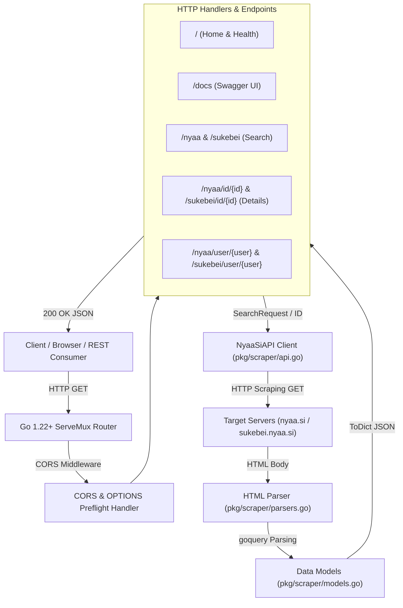
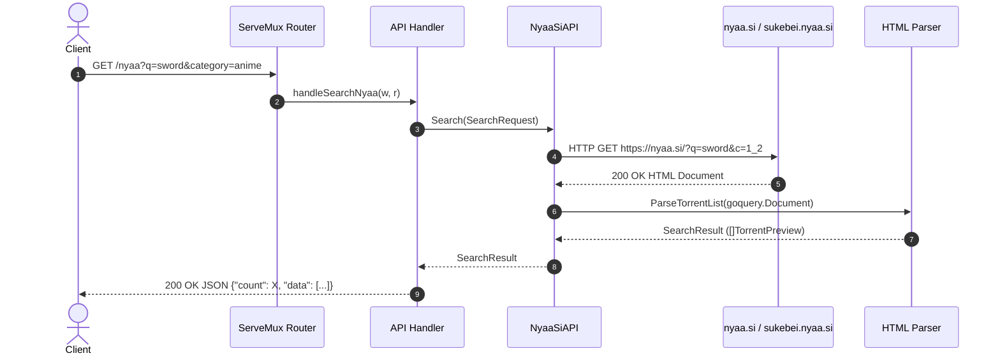

# NyaaSi-API-Go (Go Port + REST API)

A high-performance, **pure-Go** rewrite of NyaaSi-API. This project provides a robust, containerized REST API built with Go `net/http` standard library that mirrors the Nyaa-API structure while offering fast execution and low memory consumption (~10MB RAM).

Scrapes **https://nyaa.si/** and **https://sukebei.nyaa.si/** directly.

---

### Features

- **High Performance**: Built with Go 1.22+ for sub-millisecond overhead and minimal memory footprint.
- **Dual Scraper Support**: Seamlessly search both [nyaa.si](https://nyaa.si/) and [sukebei.nyaa.si](https://sukebei.nyaa.si/).
- **Full REST Implementation**: Includes search, user uploads, and detailed torrent lookups.
- **Standardized Output**: Returns consistent JSON schemas for easy integration: `{"count": X, "data": [...]}`.
- **Interactive Documentation**: Built-in Swagger UI at `/docs`.
- **Microservice Ready**: Multi-stage lightweight Docker image (`alpine`).

---

### Getting Started

#### Docker (Recommended)
The simplest way to get the API up and running is by using Docker or Docker Compose.

**Option A: Docker Compose**
1. **Clone the repository**:
   ```bash
   git clone https://github.com/khw315/NyaaSi-API-Go.git
   cd NyaaSi-API-Go
   ```
2. **Start the service**:
   ```bash
   docker compose up --build -d
   ```
3. **Access the API**:
   - **Documentation**: [http://localhost:8383/docs](http://localhost:8383/docs)
   - **Base URL**: `http://localhost:8383`

---

### API Reference

#### Search
`GET /nyaa` or `GET /sukebei`

| Parameter | Type | Description | Example |
| :--- | :--- | :--- | :--- |
| `q` | `str` | The search query string. | `Sword Art Online` |
| `category` | `str` | Main category filter (see Taxonomy table). | `anime` |
| `sub_category` | `str` | Detailed subcategory filter. | `english` |
| `sort` | `str` | Sort by: `comments`, `size`, `date`, `seeders`, `leechers`, `downloads`. | `seeders` |
| `order` | `str` | Sorting order: `asc` or `desc`. | `desc` |
| `page` | `int` | Pagination page number. | `1` |

#### Torrent Lookup
`GET /nyaa/id/{torrent_id}` or `GET /sukebei/id/{torrent_id}`

Fetches full details including description, magnet link, hash, and file structure.

#### User Search
`GET /nyaa/user/{user_name}` or `GET /sukebei/user/{user_name}`

Search for torrents uploaded by a specific user. Supports the same query parameters as global search.

---

### Taxonomy Reference

| Site | Categories | Subcategories |
| :--- | :--- | :--- |
| **Nyaa** | `anime`, `audio`, `literature`, `live_action`, `pictures`, `software` | `english`, `raw`, `non-english`, `lossless`, `lossy` |
| **Sukebei** | `art`, `real` | `anime`, `doujinshi`, `games`, `manga`, `pictures`, `photobooks`, `videos` |

---

### 🏗️ System Architecture & Data Flow

#### Component Architecture


#### Request & Scraping Sequence


#### Module Responsibilities
- **[main.go](main.go)**: Web server initialization, Go 1.22 `ServeMux` path routing, CORS middleware, error helpers, and Swagger UI integration at `/docs`.
- **[pkg/scraper/api.go](pkg/scraper/api.go)**: HTTP client for scraping `nyaa.si` and `sukebei.nyaa.si`, handling URL query encoding, and handling HTTP errors (404/500).
- **[pkg/scraper/parsers.go](pkg/scraper/parsers.go)**: HTML DOM parsing powered by `goquery`, converting torrent tables and detailed torrent panels into structured Go structs.
- **[pkg/scraper/models.go](pkg/scraper/models.go)**: Domain data models (`TorrentPreview`, `TorrentInfo`, `TorrentComment`), category mapping taxonomy, and JSON serializer helpers (`ToDict()`).

---

### Disclaimer
This project is for educational and research purposes only. The API solely scrapes publicly available metadata from third-party websites and does **not** host, store, or distribute any torrent files or copyrighted content itself.

---

### License
[GPL-3.0 License](LICENSE)